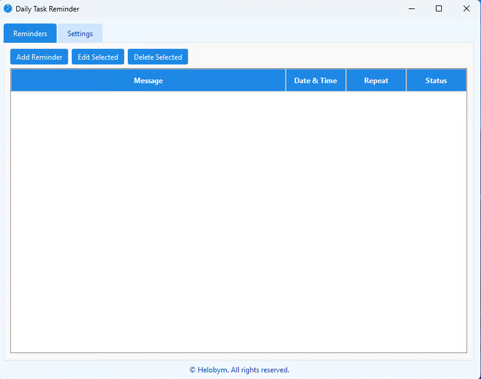
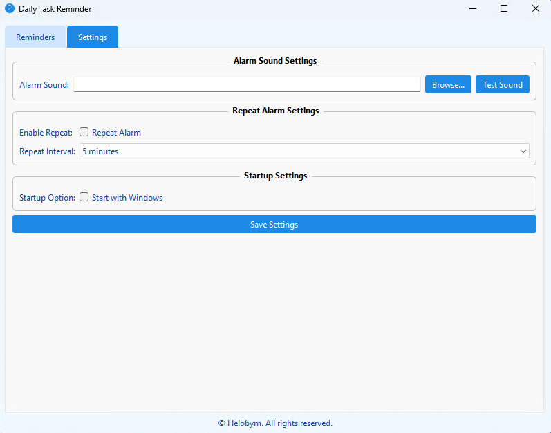

This software is developed by [Helobym](https://helobym.com)

The Daily Task Reminder software is designed to support users in managing their everyday responsibilities and routines. It helps individuals organize their daily schedules by allowing them to list tasks they need to complete throughout the day. The software sends timely reminders, ensuring that important activities are not forgotten or overlooked. By providing notifications and an overview of what needs to be done, it assists users in staying productive, maintaining good habits, and reducing the stress that comes from trying to remember multiple commitments. The goal is to make daily life more organized and manageable, giving users the confidence that their essential tasks will be accomplished on time.

[Demo Video](https://youtu.be/gGKjb9Jc6tM)

